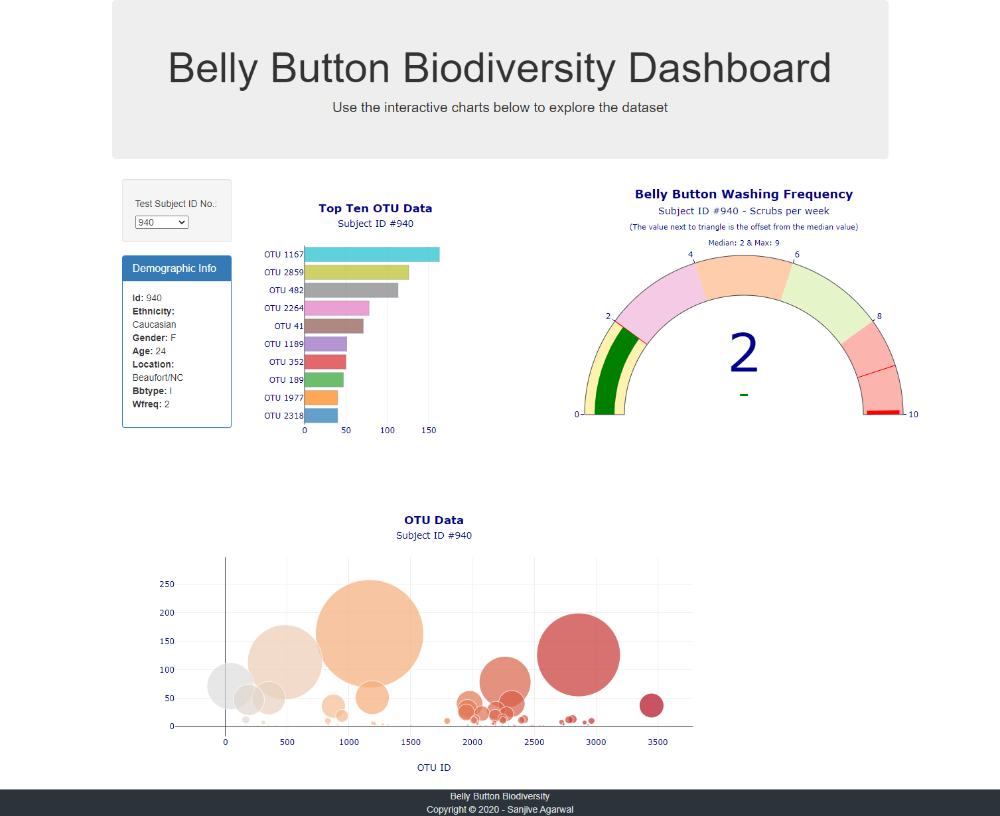

# BCS_12_Belly-Button-Biodiversity-Dashboard

Belly Button Biodiversity Dashboard Assignment (https://sanjive.github.io/BCS_12_Belly-Button-Biodiversity-Dashboard/bellybutton/)

- Created a Belly Button Biodiversity Dashbord
- Displays a list to select a subject
- The Dashbiard displays the selected subjects Demographics and the data as Horizontal bar and bubble charts

